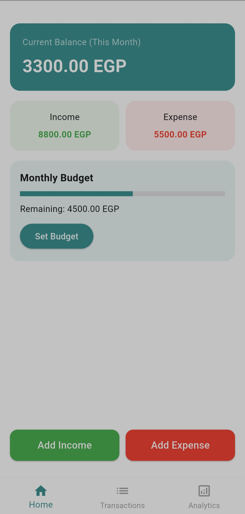
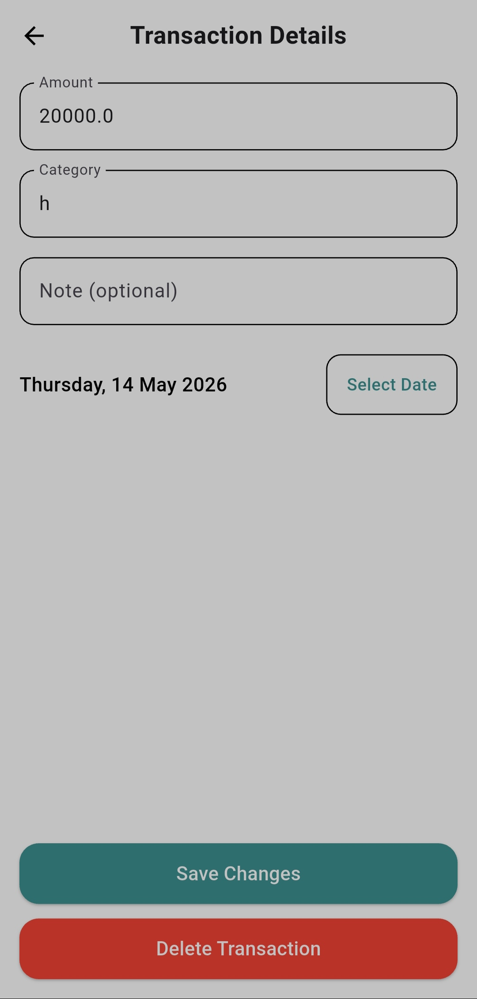
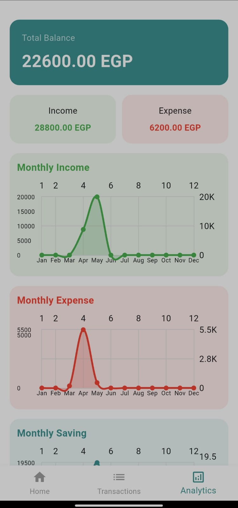

# 🏦 Personal Finance Companion Mobile App

A **personal finance companion** built with **Flutter & GetX** using **SQLite** for local data storage.  
This app helps users track their daily transactions, manage income and expenses, monitor budgets, and view analytics through charts for better financial insights.

---

## 🚀 Features

### **1. Home Dashboard**
- Displays a **summary of the current month**:  
  - Total balance  
  - Total income  
  - Total expenses  
- Add **income** and **expense transactions** directly from the home screen.  
- Budget limit overview for the month.

### **2. Transaction Management**
- Add, edit, and delete transactions.  
- Each transaction includes:  
  - Amount  
  - Type: Income / Expense  
  - Category  
  - Date  
  - Optional note  
- Full **transaction list** accessible from the "All Transactions" screen.  
- Search and filter transactions by category.  
- Transactions grouped by month for better readability.  

### **3. Analytics & Insights**
- Dashboard includes **three charts**:  
  - Income trends by month  
  - Expense trends by month  
  - Monthly savings progress  
- Displays **total balance, total income, and total expenses**.  
- Helps users understand **spending patterns** and **financial health**.

### **4. Budget Limit**
- Set a **monthly budget**.  
- Monitor expenses against the set budget with visual indicators.  
- Alerts when expenses approach or exceed the budget.

### **5. User Experience & UI**
- Smooth navigation using **GetX routing**.  
- Clean forms with **validation**, **date pickers**, and editable fields.  
- Touch-friendly buttons, responsive layouts, and **cards with shadow effects**.  
- Clear separation between UI, controller logic, and database layer.

### **6. Local Data Handling**
- Uses **SQLite** to store transactions and budget data.  
- GetX controllers handle state management and database interactions.  
- Persistent local storage ensures data is available **offline**.

---

## 🎨 Screenshots

> Replace these placeholders with your actual screenshots:

  
*Monthly overview with balance, income, expenses, and add transaction options.*

  
*Full transaction list with search bar.*

  
*Edit transaction details or delete.*

  
*Three charts showing income, expenses, and savings trends by month.*

---

## 🛠️ Technology Stack

- **Framework:** Flutter  
- **State Management:** GetX  
- **Local Database:** SQLite  
- **Charts:** fl_chart  
- **Language:** Dart  
- **Platform:** Android / iOS  

